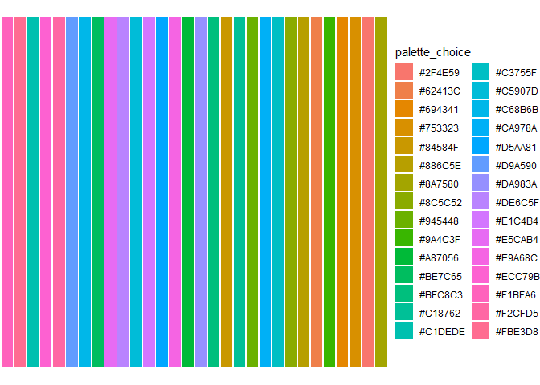
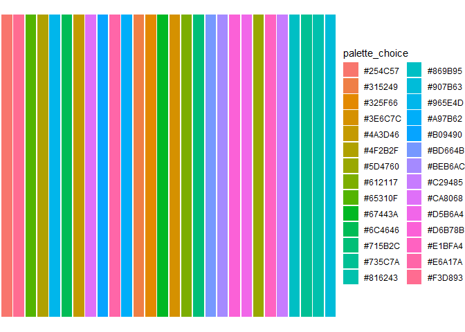
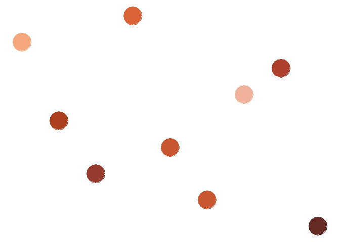
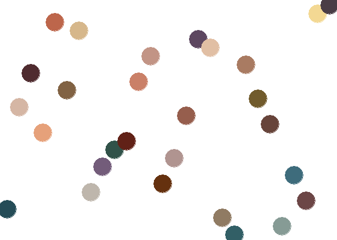

<!-- README.md is generated from README.Rmd. Please edit that file -->

# colouRpop

<!-- badges: start -->
<!-- badges: end -->

I made some color palettes based on ColourPop’s eyeshadow palettes! Are
they the most practical color palettes to make figures with?

Of course not! But are they fun? I think so!

Hope you enjoy :)

To install the package, run:

## Installation

You can install the development version of colouRpop from
[GitHub](https://github.com/) with:

``` r
# install.packages("devtools")
devtools::install_github("Michaeladebolt/colouRpop")
```

## Example

After you’ve installed the package, to preview what a palette looks like
you can run:

``` r
library(colouRpop)
colouRpop(palette = "youre_golden", show_me = TRUE)
```



``` r
colouRpop(palette = "its_a_mood", show_me = TRUE)
```



To use a palette in a figure, delete the `show_me` argument, or change
it to `FALSE` (the default is `FALSE`). You can use the `colouRpop`
function directly in a plot, or save the output to an object to use in a
plot. For example:

``` r
library(ggplot2)
fake_data <- data.frame(x = as.factor(rnorm(n = 9, mean = 5, sd = 1) ),
                        y = as.factor(rnorm(n = 9, mean = 5, sd = 1)))

ggplot(data = fake_data, 
       aes(x = x, y = y)) +
  geom_point(color = colouRpop(palette = "big_poppy"), 
             size = 12.5) +
  theme_void() 
```



You can also save the output of the function to an object, and then use
that object in your plot. For example:

``` r
colors <- colouRpop(palette = "its_a_mood", show_me = FALSE)

fake_data <- data.frame(x = as.factor(rnorm(n = 28, mean = 5, sd = 1) ),
                        y = as.factor(rnorm(n = 28, mean = 5, sd = 1)))

ggplot(data = fake_data, 
       aes(x = x, y = y)) +
  geom_point(color = colors, 
             size = 12.5) +
  theme_void() 
```



Below are pictures of the original palettes. These images were taken
from ColourPop’s website: <https://colourpop.com/>


